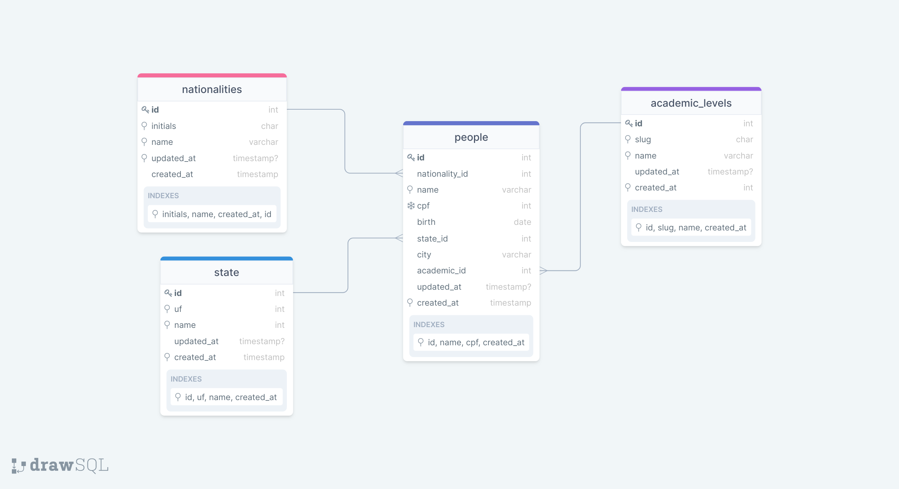

# Desafio Fiocruz Brasília

> Desafio proposto pela empresa Fiocruz de Brasília, para medir o conhecimento no processo seletivo, para a vaga de Desenvolvedor Backend Laravel Pleno.

## ⚠ Requisitos:

- PHP >= 7.2.5
- Node.Js >= 12.13.1
- NPM >= 6.13.4
- PostgreSQL >= 12.2
- Docker e Docker Compose (opcional)

##### Deve ter o ambiente para o laravel configurado:

- BCMath PHP Extension
- Ctype PHP Extension
- Fileinfo PHP extension
- JSON PHP Extension
- Mbstring PHP Extension
- OpenSSL PHP Extension
- PDO PHP Extension
- Tokenizer PHP Extension
- XML PHP Extension

## Modelagem do Banco de Dados



## O que foi utilizado no desafio:

- Laravel Framework
- Bootstrap
- Jquery
- DataTables
- Axios
- Jquery Validate
- Block Ui
- Date Fns
- Jquery Mask
- Sweet Alert
- Docker
- API do IBGE => Para consultar os munícipios
- Laravel Debugar
- Banco de Dados PostgreSQL

## ⚡ Mão na massa:

> Você pode realizar o clone deste repositório ou baixar o arquivo .zip!

##### Clone este repositório:

````
git clone https://github.com/huriellopes/DesafioFiocruz.git
````

Para baixar o zip: [https://github.com/huriellopes/DesafioFiocruz/archive/master.zip](https://github.com/huriellopes/DesafioFiocruz/archive/main.zip)

## ✔ Executando a aplicação:

##### Temos duas opções para testar o projeto:
- **Local**
  - **Requisitos:**
    - PHP
    - Banco de Dados PostgreSQL  
  - **Para testar no ambiente local, siga o seguinte passo a passo:**
    ````
    # Para instalar as dependências do Laravel
    componser install
    
    # Para copiar o .env.example para .env
    copy .env.example .env ou cp .env.example .env
    
    # configure as seguintes variaveis de ambiente
    DB_CONNECTION=pgsql # default = mysql
    DB_HOST=127.0.0.1 ou localhost
    DB_PORT=5432 # default = 3306
    DB_DATABASE=laravel
    DB_USERNAME=root
    DB_PASSWORD=
    
    # **ATENÇÃO**: Deve ser PostgreSQL e lembre-se de criar o schema/banco!
    
    # Para rodar as migrates e seeds
    php artisan migrate --seed
    
    # Caso queira desafazer
    php artisan migrate:rollback
    
    # Para rodar o servidor embutido
    php artisan serve
    
    # Irá executar na seguinte url, abra no navegador
    http://localhost:8000
    ```` 
- **Docker**
    - **Requisitos:**
      - **Windows 10 PRO/Enterprise:**
        - Link: [Instalação](https://hub.docker.com/editions/community/docker-ce-desktop-windows)
          - Para verificar se foi instalado corretamente, rode o seguinte comando:
            ````
            docker version
            ````
      - **Windows 10 Home**
        - WSL2 + Docker Desktop
          - Link: [Passo a Passo](https://www.notion.so/Docker-Desktop-WSL-2-fc6af93d3cac4de9a4a185f78c4a9566)
        
        - Docker Toolbox
          - Link: [Instalação](https://www.notion.so/Docker-Toolbox-legacy-7234f5f412444cabb70d0270b1ecc01a)
        
      - **Linux**
        - Rode os seguintes comandos:
          ````
          # Comandos para instalar o docker
          sudo apt update
          sudo apt remove docker docker-engine docker.io
          sudo apt install docker.io
          
          # Habilitar para iniciar automaticamente com o sistema:
          sudo systemctl start docker
          sudo systemctl enable docker
          
          # Verificando se foi instalado corretamente:
          docker version
          
          # Você precisará executar todos comandos do Docker utilizando o sudo, mas caso queira executa-los sem o sudo,utilize:
          [Guia]https://docs.docker.com/engine/install/linux-postinstall/#manage-docker-as-a-non-root-user
          
          # Para instalar o docker-compose, rode o seguinte comando:
          sudo apt install docker-compose
          ````
    
    - **Para testar no ambiente docker:**
    
    ````
    # Copie o arquivo de configuração do docker 
    copy docker-compose.example.yml docker-compose.yml ou cp docker-compose.example.yml docker-compose.yml
  
    environment:
      POSTGRES_USER: "postgres"
      POSTGRES_PASSWORD: "YOUR_PASSWORD"
      POSTGRES_DB: "DATABASE_NAME"

    # O banco de dados está isolado, apenas a aplicação acessa!
  
    # Para subir os dois containers
    docker-compose up -d
    
    # Depois acesse o container de servidor
    docker exec -it server sh
    
    # Rode o composer
    composer install
    
    # Depois o migrate e seed
    php artisan migrate --seed
    
    # Caso queira desafazer
    php artisan migrate:rollback
    
    # Para acessar no navegador
    http://localhost
    ````
## Créditos

- Empresa FioCruz Brasília - Pelo desafio proposto [Site da Empresa](https://www.fiocruzbrasilia.fiocruz.br/efg/)

## Licença

- Este projeto está sob a licença MIT. **Veja aqui** [License](LICENSE)

